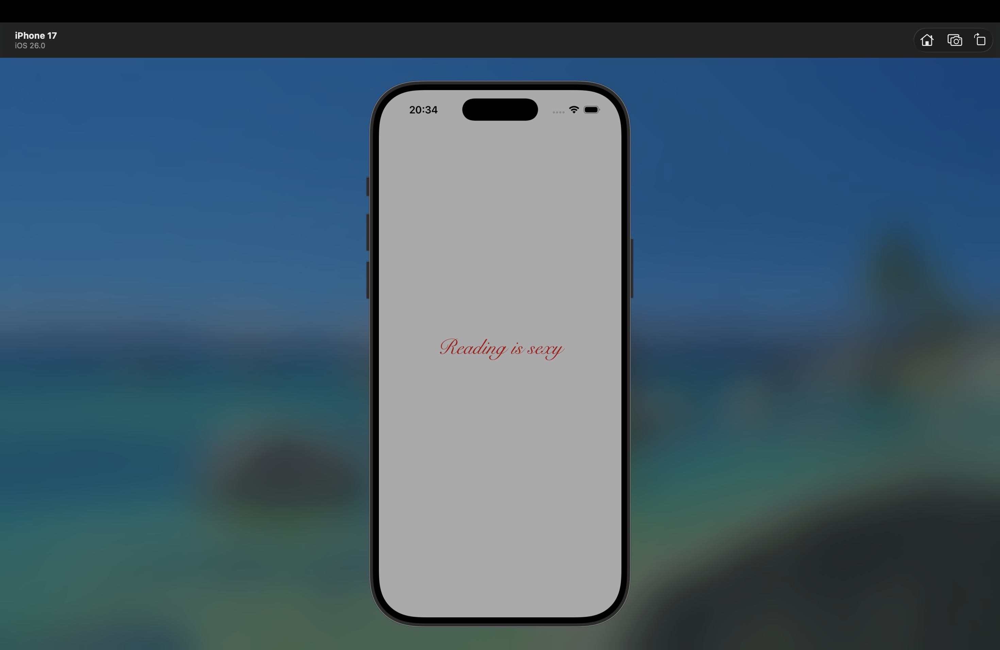
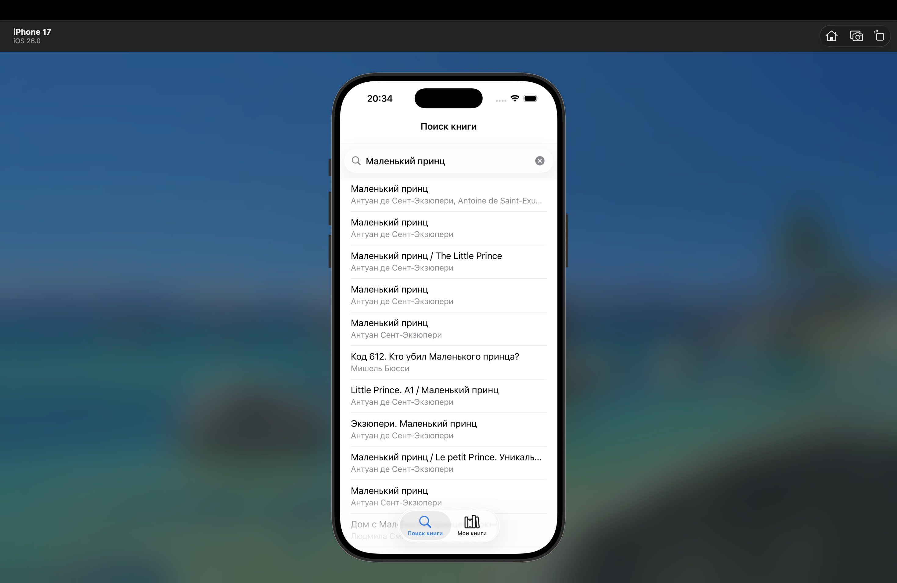
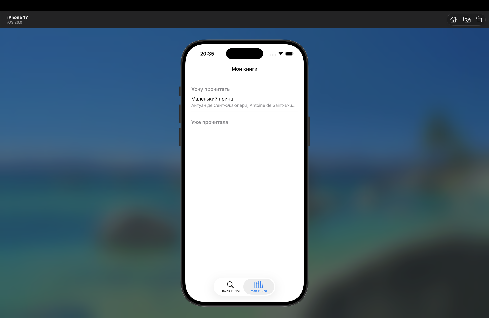

# 📚 BookTracker — iOS-приложение для отслеживания прочитанных книг

Приложение позволяет искать книги через Google Books API, сохранять их в один из двух списков:  
 **«Хочу прочитать»** или  **«Уже прочитала»**, с возможностью просмотра и удаления.

Приложение создано для поддержания привычки читать, для удобного сохранения книг, которые были найдены случайно или порекомендованы друзьями/ коллегами. Также планирется расширение функций приложения для отслеживания прогресса в чтении

---

##  Основные функции

-  Поиск книг по названию или автору через **Google Books API**
-  Просмотр подробной информации: обложка (SF Symbols), описание, автор
-  Добавление книги в один из двух списков
-  Удаление книг свайпом влево
-  Полностью адаптивный интерфейс с поддержкой длинных описаний (автоматический скролл)
-  Кастомный splash-экран с анимацией появления
-  Локальное хранение данных с помощью **Core Data**

---

##  Технологии и стек

| Категория          | Стек                                                                 |
|--------------------|------------------------------------------------------------------------------|
| **Язык**           | Swift 5.9                                                                   |
| **Фреймворк UI**   | UIKit через код, кроме LanchScreen.storyboard - он настроен через Attributes Inspector                    |
| **Архитектура**    | MVC                                                                         |
| **Сетевые запросы**| URLSession + Codable                                                         |
| **Хранение данных**| Core Data (сущность `Book`: id, title, author, descriptionText, status и др.)|
| **UI/UX**          | Auto Layout, UIScrollView, UITableView, UISearchBar, Tab Bar Controller      |
| **Особенности**    | Анимации (UIView.animate), SF Symbols, безопасная работа с памятью ([weak self]) |

---

## Скриншоты возможностей приложения

| Launch Screen | Welcome Screen | Поиск | Результат поиска книги | Страница выбранной книги | Добавили книгу в список | Мои книги | Удаление книги |
|---------------|---------------|-------|--------------|-----------|-----------|-----------|-----------|
|  |  |  |  |  | | | |

---

